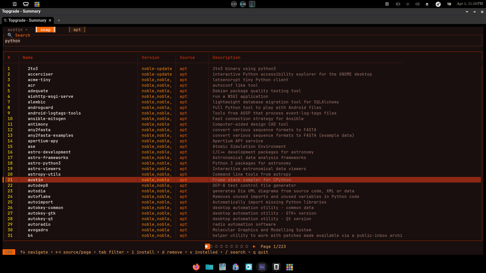
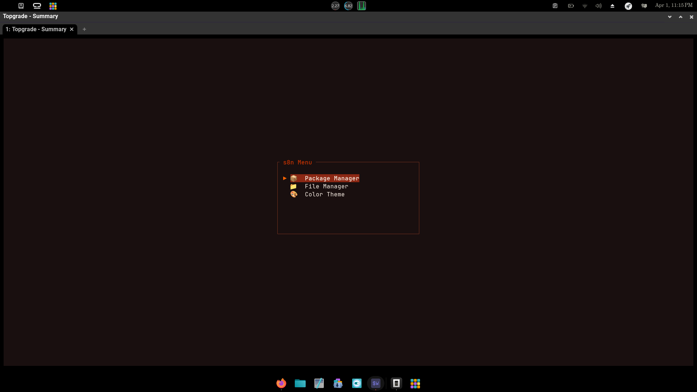
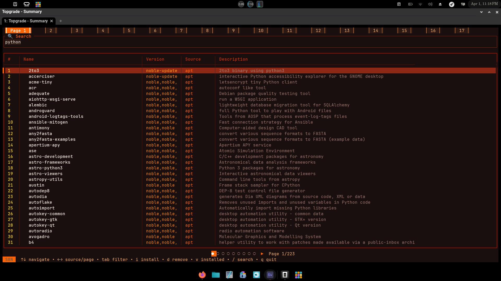
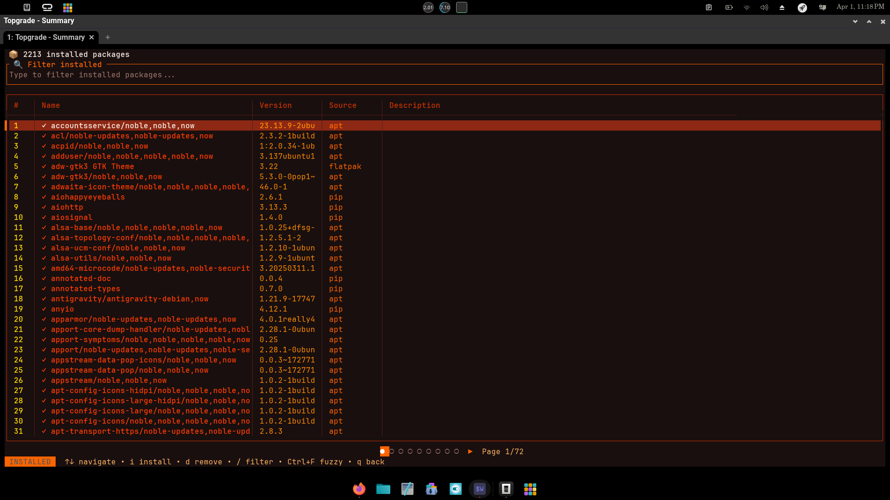
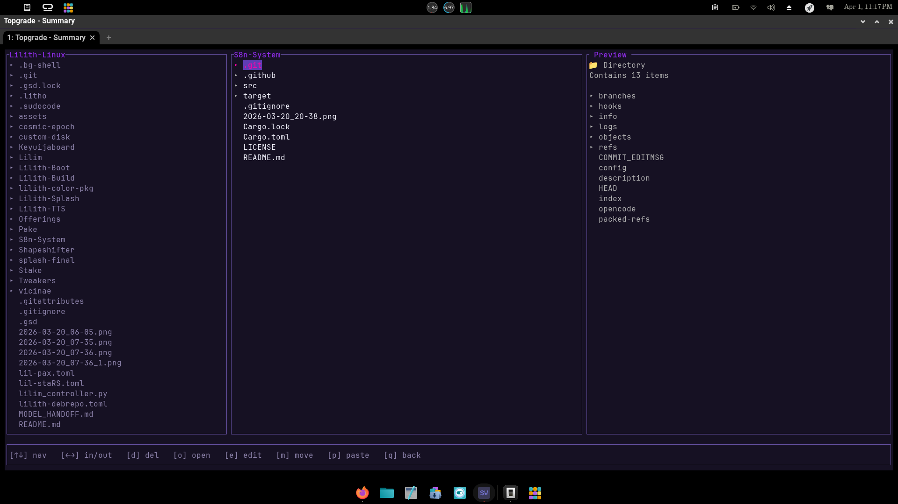
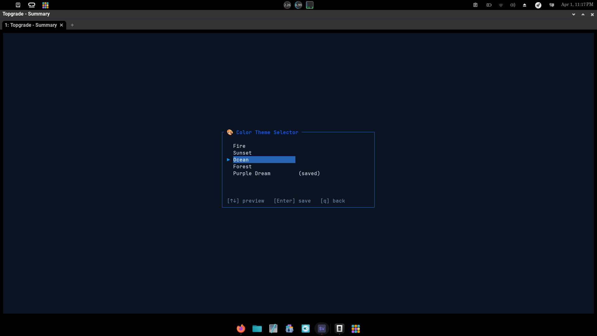

# S8n System Manager

[](https://github.com/BlancoBAM/S8n-System/actions/workflows/ci.yml)
[](https://github.com/BlancoBAM/S8n-System/actions/workflows/release.yml)
[](https://crates.io/crates/s8n)
[](LICENSE)

**S8n** is a fast, visually stunning System Manager, Unified Package Manager, and File Manager built in Rust.  
It provides native terminal color themes, Miller-column file browsing, a graveyard for safe file deletion and recovery, and cross-package-manager search with relevance-ranked results — all from one beautiful terminal interface.

Designed for **Lilith Linux**, though it works on any Debian-based system.



---

## Table of Contents

- [Features](#features)
- [Quick Start](#quick-start)
- [CLI Reference](#cli-reference)
- [Installation](#installation)
- [Usage Guide](#usage-guide)
  - [Main Menu](#main-menu)
  - [Package Manager — Search & Browse](#package-manager--search--browse)
  - [Package Detail Panel](#package-detail-panel)
  - [Installed Packages View](#installed-packages-view)
  - [Graveyard (Safe Delete & Recovery)](#graveyard-safe-delete--recovery)
  - [File Manager](#file-manager)
  - [Theme Picker](#theme-picker)
- [Keyboard Reference](#keyboard-reference)
- [Supported Package Managers](#supported-package-managers)
- [Configuration](#configuration)
- [Building from Source](#building-from-source)
- [Contributing](#contributing)
- [Inspirations & Credits](#inspirations--credits)
- [License](#license)

---

## Features

- **Unified Package Manager** — Search, install, and remove packages across 10+ package managers from a single TUI (apt, flatpak, snap, brew, npm, pip, cargo, pacstall, soar, am, and more)
- **Relevance-Ranked Results** — Search results are automatically sorted by match quality: exact matches first, then prefix matches, then partial matches, then description matches
- **Clean Descriptions** — ANSI codes, markdown formatting, and unicode artifacts are stripped from all package names and descriptions before display
- **Installed Status Tracking** — Packages are cross-referenced against every PM's installed list; installed packages are highlighted regardless of how they were installed
- **Package Detail Panel** — Press `i` on any search result to view full metadata before committing to an install
- **Installed Packages View** — See all system-wide installed packages at a glance, sorted alphabetically, with filtering
- **Animated Progress Displays** — Theme-aware gradient progress bars and braille spinners during install/remove operations
- **Miller-Column File Manager** — Safe directory traversal with drill-down exploration, file editing (`$EDITOR`), moves, renames, and deletions via rip2 graveyard
- **Graveyard (Safe Deletion)** — Files and packages deleted via s8n are buried in a rip2 graveyard (`~/.local/share/graveyard/s8n/`) and can be recovered with `s8n xum`
- **Dynamic Theming Engine** — Switch the aesthetic of the entire application live with 5 built-in themes: Fire, Ocean, Sunset, Forest, and Purple Dream
- **Keyboard-Native** — Vim-style navigation (`j/k/h/l`) alongside arrow keys, designed for efficiency

---

## Quick Start

```bash
# Install via cargo
cargo install s8n

# Or download a pre-built binary (see Installation)
s8n
```

Navigate the main menu with arrow keys or `j/k`. Press `Enter` to select a mode. Press `q` or `Esc` to go back or quit.

---

## CLI Reference

S8n exposes a full CLI for scripted and non-TUI use:

```
s8n [COMMAND]
```

| Command | Aliases | Description |
|---------|---------|-------------|
| `s8n` | — | Launch the full TUI |
| `s8n srch <pkg>` | `search`, `find` | Search for a package across all sources |
| `s8n stall <pkg>` | `install`, `add` | Install the specified package |
| `s8n brn <pkg>` | `burn`, `remove`, `rm` | Remove (bury) the specified package |
| `s8n xum [pkg]` | `exhume`, `recover` | Recover a buried package from the graveyard |
| `s8n shw` | `show`, `list` | List all installed packages from all sources |
| `s8n upd8` | `update`, `upgrade` | Update all packages via topgrade |
| `s8n -h` / `s8n --help` | — | Show this help screen |

**Examples:**

```bash
s8n srch neovim          # Search for neovim across all package managers
s8n stall neovim         # Install neovim
s8n brn neovim           # Remove neovim (buried safely in the graveyard)
s8n xum neovim           # Recover neovim from the graveyard
s8n shw                  # List all installed packages
s8n upd8                 # Run topgrade to update everything
```

---

## Installation

### Binary Release (Recommended)

Download the pre-built binary from [GitHub Releases](https://github.com/BlancoBAM/S8n-System/releases):

```bash
# Download the latest release
curl -L -o s8n https://github.com/BlancoBAM/S8n-System/releases/latest/download/s8n-linux-amd64
chmod +x s8n
sudo mv s8n /usr/local/bin/
```

Or install via `.deb` package (available on the releases page):

```bash
sudo dpkg -i s8n_*.deb
```

### From crates.io

```bash
cargo install s8n
```

> **Note:** `cargo install` places the binary in `~/.cargo/bin/s8n`.  
> Ensure `~/.cargo/bin` is in your PATH:
> ```bash
> echo 'export PATH="$HOME/.cargo/bin:$PATH"' >> ~/.bashrc && source ~/.bashrc
> ```

### From Source

```bash
git clone https://github.com/BlancoBAM/S8n-System.git
cd S8n-System
cargo build --release
cp target/release/s8n ~/.local/bin/s8n
```

### Prerequisites

- **Rust toolchain** (for building): `rustc` and `cargo`
- **rip2** (for graveyard/safe delete): `cargo install rm-improved`
- **topgrade** (for `s8n upd8`): [github.com/topgrade-rs/topgrade](https://github.com/topgrade-rs/topgrade)

---

## Usage Guide

### Main Menu

Launch with `s8n` to see the main menu:



| Option | Description |
|--------|-------------|
| **Package Manager** | Search, install, and manage packages across multiple sources |
| **File Manager** | Browse and manage files with Miller-column navigation |
| **Color Theme** | Preview and select a visual theme for the application |

### Package Manager — Search & Browse

The package manager is the core feature. Enter a search term to query all available package managers simultaneously.


**Workflow:**

1. **Search** — Type a package name and press `Enter`. Results are fetched from all installed PMs concurrently.
2. **Browse** — Use `↑/↓` to navigate. Results are **ranked by relevance** — exact name matches appear first.
3. **Install** — Press `Enter` on a highlighted package to open the install confirmation dialog.
4. **Info** — Press `i` to open the Package Detail panel and view full metadata before installing.
5. **Switch source** — Use `←/→` to switch between package sources or paginate results.
6. **Filter by PM** — Press `Tab` to cycle through package manager tabs.
7. **Remove** — Press `d` or `r` to remove a package.

**Source tabs:** When a package is available from multiple sources, tabs appear at the top showing each source. Use `←/→` to switch.



### Package Detail Panel

Press `i` on any search result to open the detail panel:

- Shows full name, version, source, and description
- Press `Enter` or `i` again to install from this panel
- Press `d` to remove (if already installed)
- Press `Esc` to go back

### Installed Packages View

Press `v` at any time in the package manager to view **all installed packages** system-wide:



- Packages collected from all available package managers
- Sorted alphabetically for easy browsing
- Press `/` to filter by name or source
- Press `Enter` or `i` to open the detail panel for the selected package
- Press `d` or `r` to remove a package
- Press `q` or `Esc` to return to browse mode

### Graveyard (Safe Delete & Recovery)

S8n uses [rip2](https://github.com/MilesCranmer/rip2) for all file and package removals. Instead of permanent deletion, files are **buried** in a graveyard at:

```
~/.local/share/graveyard/s8n/
```

To recover a buried file or package:

```bash
s8n xum              # Interactive recovery (choose from graveyard)
s8n xum <pkg-name>   # Recover a specific item by name
```

You can also navigate into the graveyard inside the TUI.

### File Manager

The Miller-column file manager lets you browse directories safely:



- **Navigate** — Arrow keys or `j/k`
- **Drill down** — `Enter` or `l` to enter a directory
- **Go back** — `h` or `Backspace` to go up
- **Edit** — `e` to open in `$EDITOR`
- **Rename** — `r` to rename
- **Delete** — `d` to bury in graveyard (recoverable with `s8n xum`)
- **Move** — `m` to move to another location

### Theme Picker

Access the theme picker from the main menu or by pressing `t` in the package manager:



- Use `↑/↓` or `j/k` to preview themes live
- Press `Enter` to save the selected theme
- Press `q` or `Esc` to return without saving

**Available themes:**

| Theme | Description |
|-------|-------------|
| **Fire** | Warm oranges and reds — the default Lilith Linux aesthetic |
| **Ocean** | Cool blues and cyans for a calm, deep-sea feel |
| **Sunset** | Rich warm gradients reminiscent of golden hour |
| **Forest** | Natural greens and earth tones |
| **Purple Dream** | Vibrant purples and pinks |

---

## Keyboard Reference

### Global

| Key | Action |
|-----|--------|
| `q` / `Esc` | Go back or quit |
| `↑` / `k` | Move up |
| `↓` / `j` | Move down |
| `Enter` | Select / confirm |

### Package Manager — Browse Mode

| Key | Action |
|-----|--------|
| `Enter` | Install selected package (opens confirmation) |
| `i` | Open Package Detail panel (info) |
| `d` / `r` | Remove selected package |
| `/` | Open search input |
| `v` | View all installed packages |
| `←` / `→` | Switch source tab or page |
| `Tab` | Cycle package manager filter tab |

### Package Detail Panel

| Key | Action |
|-----|--------|
| `Enter` / `i` | Install the package |
| `d` | Remove the package |
| `Esc` | Go back to browse |

### Installed Packages View

| Key | Action |
|-----|--------|
| `Enter` / `i` | Open detail panel |
| `d` / `r` | Remove selected package |
| `/` | Filter installed packages |
| `q` / `Esc` | Return to browse mode |

### File Manager

| Key | Action |
|-----|--------|
| `Enter` / `l` | Enter directory |
| `h` / `Backspace` | Go up one level |
| `e` | Edit file in `$EDITOR` |
| `r` | Rename file |
| `d` | Delete (bury in graveyard) |
| `m` | Move file |

---

## Supported Package Managers

S8n automatically detects which package managers are installed on your system. Only available managers are shown in the TUI.

| Manager | Binary | Search | Install | Remove | List Installed |
|---------|--------|:------:|:-------:|:------:|:--------------:|
| **apt** | `apt` | ✓ | ✓ | ✓ | ✓ |
| **flatpak** | `flatpak` | ✓ | ✓ | ✓ | ✓ |
| **snap** | `snap` | ✓ | ✓ | ✓ | ✓ |
| **brew** | `brew` | ✓ | ✓ | ✓ | ✓ |
| **npm** | `npm` | ✓ | ✓ | ✓ | ✓ |
| **pip** | `pip` / `pip3` | ✓ | ✓ | ✓ | ✓ |
| **cargo** | `cargo` | ✓ | ✓ | ✓ | ✓ |
| **pacstall** | `pacstall` | ✓ | ✓ | ✓ | ✓ |
| **soar** | `soar` | ✓ | ✓ | ✓ | ✓ |
| **am** | `am` | ✓ | ✓ | ✓ | ✓ |
| **bun** | `bun` | — | ✓ | ✓ | ✓ |
| **topgrade** | `topgrade` | — | — | — | — (update-all) |

> All managers are **auto-detected** at startup. If a binary isn't in your `PATH`, that manager is silently skipped.

---

## Configuration

S8n stores its configuration at `~/.config/s8n/`:

```
~/.config/s8n/
└── theme.toml    # Current theme selection
```

The theme file is a simple TOML file:

```toml
theme = "Fire"
```

You can edit this file manually, or use the built-in theme picker.

---

## Building from Source

### Requirements

- Rust 1.70+ (edition 2021)
- `cargo`

### Build

```bash
# Debug build
cargo build

# Release build (optimized)
cargo build --release
```

### Run tests

```bash
cargo test
```

### Lint

```bash
cargo clippy -- -D warnings
cargo fmt -- --check
```

---

## Contributing

Contributions are welcome! Please feel free to:

- Report bugs via [GitHub Issues](https://github.com/BlancoBAM/S8n-System/issues)
- Submit pull requests
- Request features or improvements

All contributions should follow the project's code style and pass `cargo clippy` and `cargo fmt`.

---

## Inspirations & Credits

The user interface and aesthetics for S8n were inspired by the incredible ecosystem of [Charmbracelet Labs](https://charm.sh/) and several outstanding Rust TUI projects.

Special thanks to the following projects and their authors:

- [joshuto](https://github.com/kamiyaa/joshuto) by [@kamiyaa](https://github.com/kamiyaa) — Miller-column file manager in Rust; a key inspiration for S8n's file manager layout and navigation feel
- [ratatui](https://github.com/ratatui-org/ratatui) — The Rust terminal UI framework powering S8n's entire interface
- [bubbletea-rs](https://github.com/whit3rabbit/bubbletea-rs) by @whit3rabbit — Reference for smooth TUI architecture and gradient progress bars
- [lipgloss-rs](https://github.com/whit3rabbit/lipgloss-rs) by @whit3rabbit — Gradient generation and heat-mapping, shaping S8n's Fire aesthetic
- [rip2 / rm-improved](https://github.com/MilesCranmer/rip2) by @MilesCranmer — Safe file deletion with graveyard recovery, powering `s8n brn` and `s8n xum`
- [topgrade](https://github.com/topgrade-rs/topgrade) — Universal system updater, powering `s8n upd8`

---

## License

This software is released under the [GNU General Public License v3.0](LICENSE).

**Beauty meets power. Evil meets elegance.**
